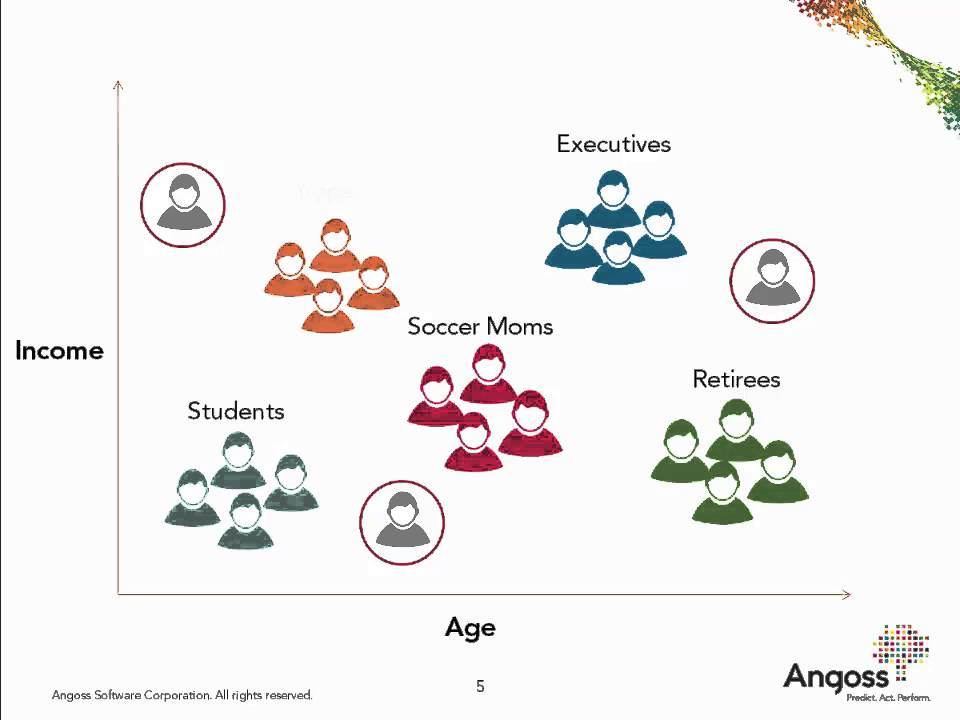

When I first heard about machine learning, I immediately associated with robots and computers. I imagined that computers with some advanced programming that can learn from human experience and predict future events. This sounds like a cool futuristic thought. In fact, machine learning has been around for decades. What is machine learning really? “Machine Learning is the science (and art) of programming computers so they can learn from data” (Géron, 2). 

Why do we need Machine Learning? Many problems can’t simply be solved by a mathematical mind, Excel spreadsheets and scientific calculators. Here comes machine learning, with the right approach, it can deal with a large amount of data, adapt to new data and find an efficient and effective solution. Machine learning can be applied in a wide variety of industries for different purposes. It can be applied in cancer diagnosis to predict whether a patient has such disease or not, it can be used in imagine recognition for face detection, and it can also help predict housing prices in the real estate industry. Here is a link to a website for [top 10 real-life examples of machine learning](https://bigdata-madesimple.com/top-10-real-life-examples-of-machine-learning/).

There are different machine learning methods depending on how they are categorized. I would like to introduce two main categories of machine learning – supervised learning and un supervised learning.
 
 

**What are supervised and unsupervised learning?**

Before going into supervised and unsupervised learning, it is important to have an idea of what training data and test data are. Training data is the data computer uses to learn, it is used to “train” the model. Test data is the data computer uses to “test” the model.

Just like the name itself, we can imagine supervised learning as an algorithm learning process under the supervision of a “professor”. The data with labels we wish to train is fed into that algorithm (Figure 1). For example, we have training data, which includes observations X (animal emojis) and y (labels for these emojis). We also have some unseen test data with X (emojis) and unknow y (labels). Then the training data with labels is fed into a learning algorithm and trained by a machine learning model function. That machine learning model would be able to predict the labels of these new examples.

*Figure 1. Supervised learning illustration (adapted from DSCI 571: Supervised Machine Learning I notes)*

For unsupervised learning, we can imagine that a system is trying to learn without the supervision of a “professor”. The training data would have observations X but without labels (Figure 2). For example, we have observations X (animal emojis) and we wish to get insights on the underlying structure of the data. We would feed the data into a machine learning algorithm and a machine learning model, next the output provides meaningful groupings of the data, such as a group of cat emojis, a group of dog emojis, etc.

*Figure 2. Unsupervised learning illustration (adapted from DSCI 563: Unsupervised Machine Learning notes)*
 
 

**Pros and cons of supervised and unsupervised learning**

As compared to unsupervised learning, supervised learning is simpler for people to understand. Since the training data has labels, people would have some idea about different labels in the beginning. Supervised learning is more commonly used for classification and prediction problems.

If we only have cat and dog labels in the training dataset, when we give an emoji of a unicorn, the output would predict the incorrect label as either cat or dog. This is one of the limitations of supervised learning. 

Unsupervised learning has less restriction on the original data. The training data does not need to have labels. Labels in the dataset are created by humans, without labels, the probability of human errors is greatly reduced. Unsupervised learning is good at discovering the unknown or hidden patterns in the data.

Unsupervised learning has its drawbacks. The accuracy of the unsupervised learning results tends to be lower comparing to supervised learning so there is more uncertainty in the results. There is no label information given in the input and the methodology is unguided, some not so interesting patterns or trends could be included in the results or output (hard to avoid).
 
 

**Cool applications of supervised and unsupervised learning**

*Housing price prediction in supervised learning*
 A usual task in supervised learning is to predict numeric values, such as housing prices. Given a dataset with attributes such as lot area, pool area, year sold, etc. (including the labels - prices), we can feed this information into a machine learning algorithm, then the algorithm can learn a model which can give prediction of prices. One application would be that someone is interested in buying a property in Vancouver, he/she has a dataset of Vancouver housing information. With machine learning, he/she could input some customized attributes of the house of interest and get an output of predicted price.

*Customer segmentation in unsupervised learning*
 Customer segmentation is a procedure of grouping people together based on demographics or behavioural patterns. It is often used in the retail and marketing industries. When we only have income and age attributes in customer data, by implementing the unsupervised learning algorithm, we can output groupings of the entire data (Figure 3). For example, we could label the low-income younger group as students, and low-income older group as retirees. By segmenting customers, businesses are able to tailor services to various groups and design strategies for increased profitability and sustainable competitive advantages.

*Figure 3. Customer segmentation (adapted from MyCustomer)*
 
 

**Conclusion**

I was a former financial analyst with no data science background. The data science concepts, supervised learning and unsupervised learning can seem tricky when people saw for the first time (including me). However, I have much enjoyed the journey since I started learning data science. I have found that concepts like supervised learning and unsupervised learning are not as difficult as they may seem in the beginning.  

If you are looking to start exploring the data science area, I hope this blog would serve as a stepping stone for you to dive in further. By understanding the big picture of supervised and unsupervised learning and their uses in different industries, I am confident that it will make your future data science journey smoother and more pleasant.

---
## Reference
“Customer Segmentation.” *MyCustomer*, 17 Jan. 2018, https://www.mycustomer.com/hr-glossary/customer-segmentation. 

Kaur, Author Mandeep, et al. “Top 10 Real-Life Examples of Machine Learning.” *Big Data Made Simple*, 21 Jan. 2020, https://bigdata-madesimple.com/top-10-real-life-examples-of-machine-learning/. 

Géron, Aurélien. *Hands-on machine learning with Scikit-Learn, Keras, and TensorFlow: Concepts, tools, and techniques to build intelligent systems.* O'Reilly Media, 2019.
